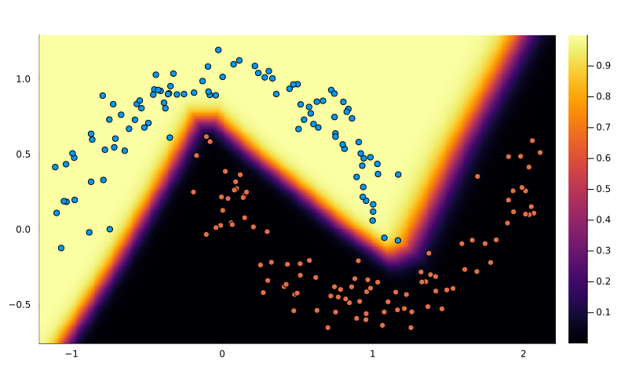

# MicroGrad.jl: Julia Automatic Differentiation

A minimal implementation of automatic differentation (AD) based on [Zygote.jl](https://fluxml.ai/Zygote.jl/) and [ChainRules.jl](https://juliadiff.org/ChainRulesCore.jl/).
See [limitations](#limitations) below.

This package is built on 3 of Julia's main principles: functional programming, multiple dispatch and metaprogramming.

It is inspired by Andrej Karpathy's [micrograd](https://github.com/karpathy/micrograd) package.
However the internal workings of this package are very different.
Micrograd creates an object (`Value`) which implements custom versions of mathematical operations that also calculate the derivative.
All operations are only done with those objects.
In this package existing functions and their arguments are dispatched to a derivative function (`rrule`). Metaprogamming is used to generate code and dispatch it following the rules of differentiation.

The two functions exposed are `rrule` and `pullback`.

Example using `rrule`:
```julia
x = 0.6
y1, back1 = rrule(cos, x) # (0.82533, cos_back(...))
y2, back2 = rrule(sin, y1) # (0.73477, sin_back(...))
Δy2 = 1.0
Δsin, Δy1 = back2(Δy2) # (nothing,  0.67831)
Δcos, Δx = back1(Δy1) # (nothing, -0.38300)
```

The `pullback` function will automatically transform the forward pass and return a `Pullback` struct that can generate the backward pass:
```julia
foo(x) = sin(cos(x))
z, back = pullback(foo, 0.6) # (0.73477, ∂(foo))
Δfoo, Δx = back(1.0) # (nothing, -0.38300)
```

Note that `pullback` returns derivatives for both the function and the arguments and so it is a mimic of `Zygote._pullback` and not `Zygote.pullback`.



This code can be used to train a simple model.
The above shows the boundary region after training a small multi-layer perceptron model to differentiate between to two half-circles.

The model is defined as:
```julia
model = Chain(
    Dense(2 => 16, activation=relu),
    Dense(16 => 16, activation=relu),
    Dense(16 => 2, activation=relu),
)
```

## Loss and activation functions

Because this AD is limited (especially with regards to control flow and broadcasting), explicit activation and loss functions and their `rrule`s are also provided. 
They are based on functions in [NNlib.jl](https://fluxml.ai/NNlib.jl).

These are:
- `sigmoid` 
- `tanh_act`
- `relu`
- `softmax`
- `logsoftmax`
- `mse`
- `cross_entropy`
- `logit_cross_entropy`
- `hinge_loss` (max-margin loss)

## Debug

Try a pullback:
```julia
z, back = pullback(f, args...)
Δ = similar(z) # Flux.jl calls this sensitivity
grads = back(Δ)
```

Debug the IR pullback code:
```julia
using IRTools: @code_ir
using MicroGrad: instrument, primal, reverse_differentiate
foo(x) = sin(cos(x))
ir = @code_ir foo(1.0)
ir = instrument(ir)
T = Tuple{typeof(foo), Float64}
pr, calls = primal(ir, T)
back_ir = reverse_differentiate(ir)
```

Alternatively, the `ir` struct can be created with:
``` julia
using IRTools: IR, meta
m = meta(T, world=Base.get_world_counter())
ir = IR(m)
```

When using the expression pullback code, do the following:
```julia
using MicroGrad: primal, reverse_differentiate
ci = @code_lowered foo(1.0)
T = Tuple{typeof(foo), Float64}
pr, calls = primal(ci, T)
back_ci = reverse_differentiate(ci, :methodinstance, :Δ)
```

Alternatively, the `ci` struct can be created with:
```julia
m = meta(T; world=Base.get_world_counter())
type_signature, sps, method_ = m
ci = Base.uncompressed_ast(method_)
```

The `pullback` function is recursive and so `pullback` calls in the above `IR`/`CodeInfo` blocks should be inspected as well.
The type `T` is the first parameter in `back::Pullback{T, S...}`.

Also inspect the output of:
```julia
world = Base.get_world_counter()
MicroGrad._generate_pullback(world, typeof(f), typeof.(args)...)
MicroGrad._generate_callable_pullback(typeof(back), world, typeof(Δ))
```

## Limitations

This package has the following limitations.
- Keyword arguments are not supported.
- Control flow is not supported.
- Like with Zygote.jl, mutating operations and try-catch statements are not supported.
- Minimal set of `rrule`s are implemented. Many core functions from `Base` are not implemented e.g. generic broadcasting, `Base.iterate` etc.
- The generated reverse code is only tested in limited scenarios and is not guaranteed to be correct in general.
- Cannot handle code with superfluous calls. This will result in `nothing` being passed to callbacks. Zygote overcomes this issue by wrapping the pullbacks with `ZBack` which returns `nothing` if the input is `nothing`. See the "confused" test.

Further, the `reverse_expr` code cannot handle:
- Creation of new variables e.g. with `map`.
- Generated code e.g. in the `Chain` layer in the examples.

## Install

Download the GitHub repository (it is not registered). Then in the Julia REPL:

```
julia> ] # enter package mode
(@v1.x) pkg> dev path\\to\\MicroGrad.jl
julia> using Revise # for dynamic editing of code. Note: will not always recompile generated functions.
julia> using MicroGrad
```

## Resources

Differentiation:
- Zygote.jl:
    - Documentation: https://fluxml.ai/Zygote.jl
    - Repository: https://github.com/FluxML/Zygote.jl
    - ZygoteRules.jl: https://github.com/FluxML/ZygoteRules.jl
- ChainRules.jl
    - Documentation: https://juliadiff.org/ChainRulesCore.jl/
    - Repository: https://github.com/JuliaDiff/ChainRules.jl
    - ChainRulesCore.jl: https://github.com/JuliaDiff/ChainRulesCore.jl

Code inspection and modificaiton:
- IRTools.jl
    - Documentation: https://github.com/FluxML/IRTools.jl
    - Repository: https://github.com/FluxML/IRTools.jl
- CodeInfoTools.jl: https://github.com/JuliaCompilerPlugins/CodeInfoTools.jl

Struct inspection:
- Functors.jl:
    - Documentation: https://fluxml.ai/Functors.jl/stable/
    - Resources: https://github.com/FluxML/Functors.jl
